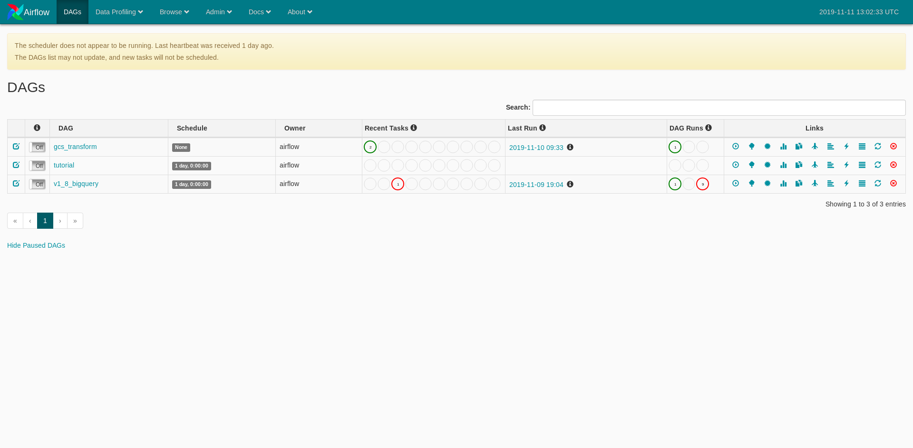
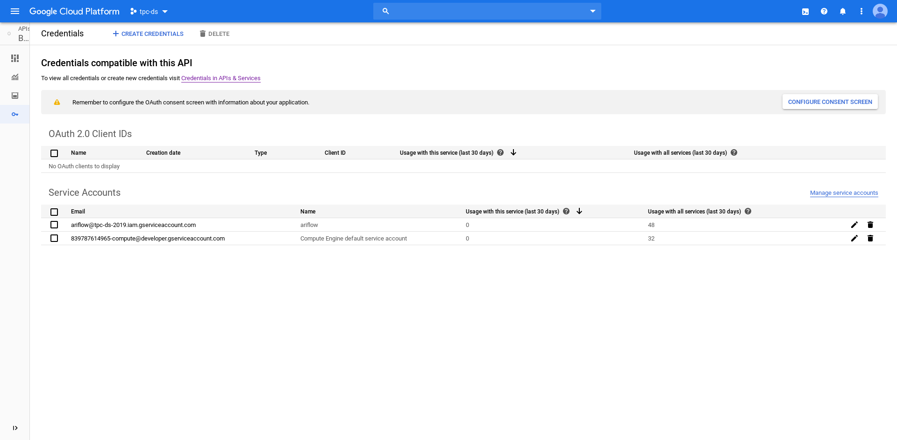
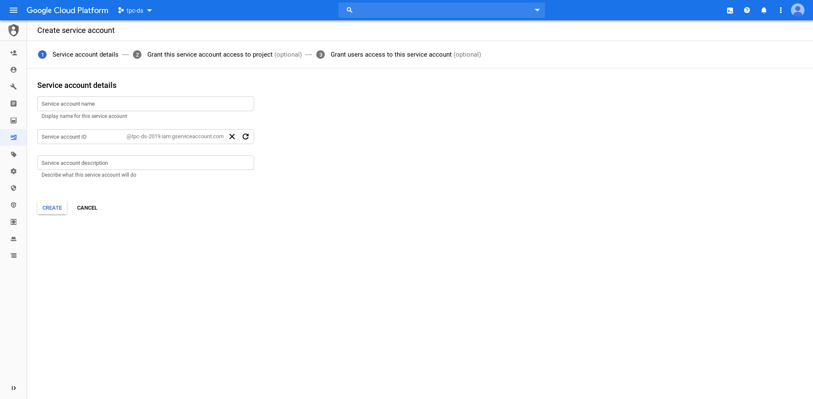
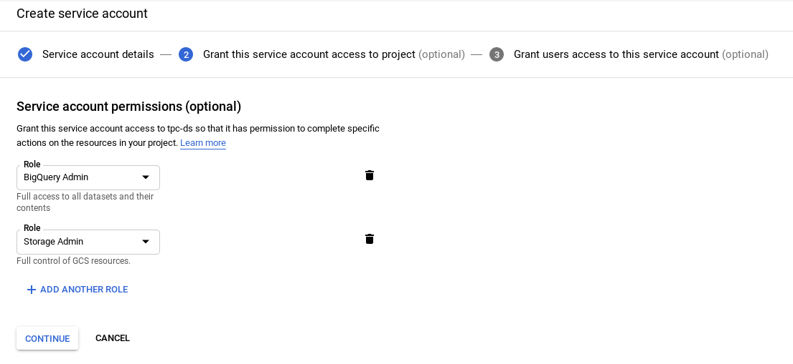
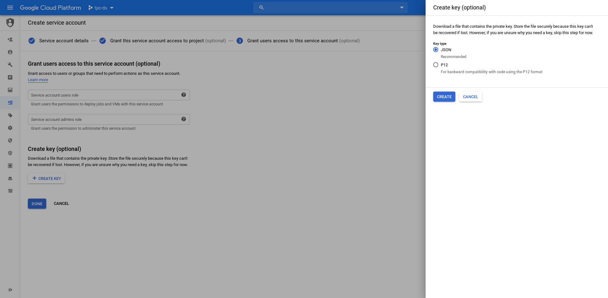
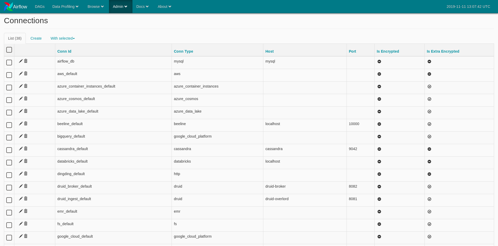
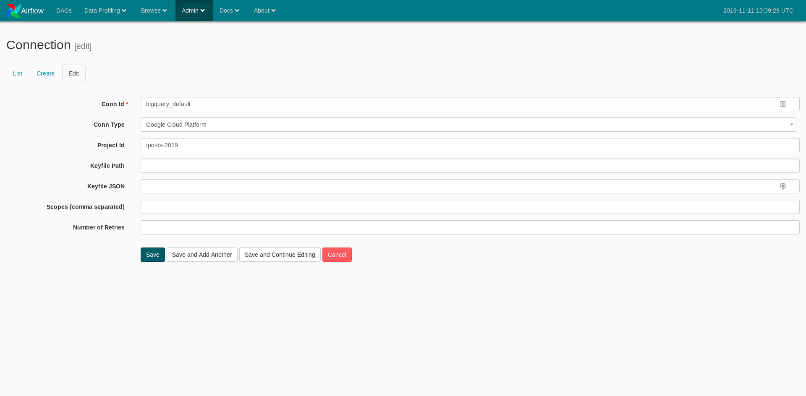

# TPC - DI - Benchmark artefacts for Cloud Composer and BigQuery

## Install Airflow:

### Create Airflow Docker Image
1. Clone Repo [Airflow Docker](https://github.com/puckel/docker-airflow)
2. Build a docker image from
    ```shell script
    cd docker-airflow
    docker build --rm --build-arg AIRFLOW_DEPS="gcp" -t tpc-di/benchmark-airflow .
    ```
3. Ensure image is created by executing
    ```shell script
    docker images
    ```

### Start Airflow
1. Run the following command to start Apache Airflow
    ```shell script
    docker-compose up -d
    ```
2. Navigate to [Airflow Web UI](http://localhost:8080/)


### Create a Service Account in GCP for Airflow to use
1. Navigate to GCP [BigQuery API](https://console.cloud.google.com/apis/api/bigquery-json.googleapis.com/overview) and enable it if not already enabled
2. Navigate to the [Credential Page](https://console.cloud.google.com/apis/api/bigquery-json.googleapis.com/credentials)

3. Click on `Create Credential` button and choose `Service Account`

4. Fill in `Service Account Name` and `ID`
5. Click on `Create`
6. Grant `BigQuery Admin` and `Storage Admin` roles and `Continue`

7. Click on `Create Key` and choose `JSON` key

8. Download generated JSON key and keep it safe

### Create connections in Airflow Admin UI
1. Navigate to Admin -> Connections [Connections Page](http://localhost:8080/admin/connection/)

2. Find `bigquery_default` connection or equivalent and edit to get the edit window

3. Fill in the contents of `keyfile.json` from GCP obtained in earlier step and save connection
4. Repeat the above steps to setup connection for `google_cloud_default`
